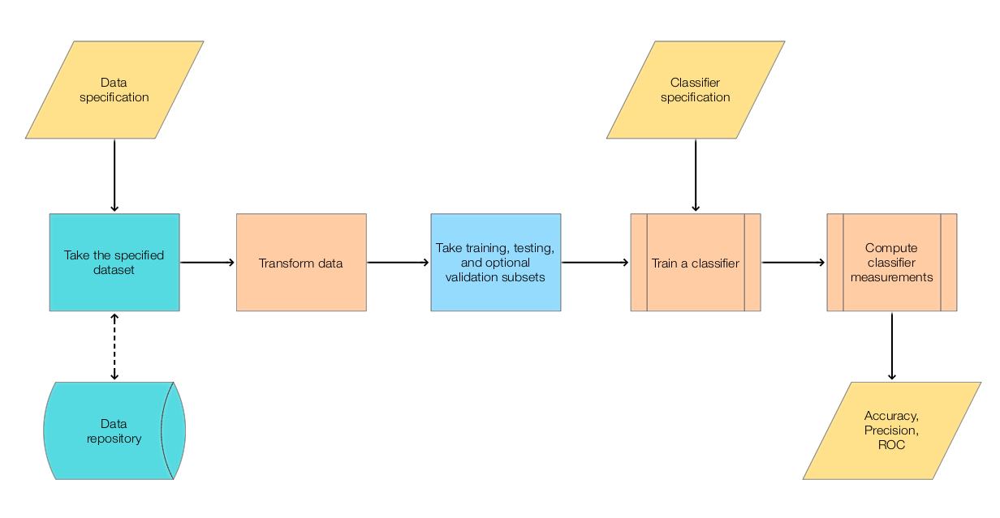
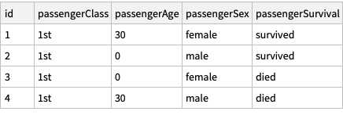
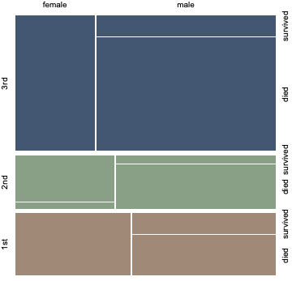
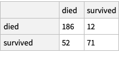
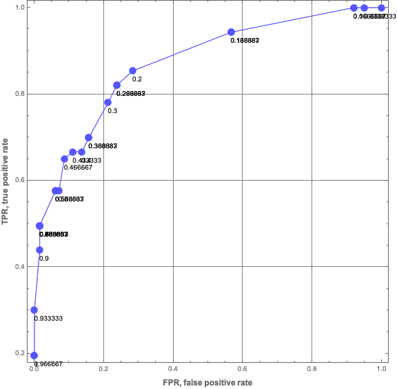
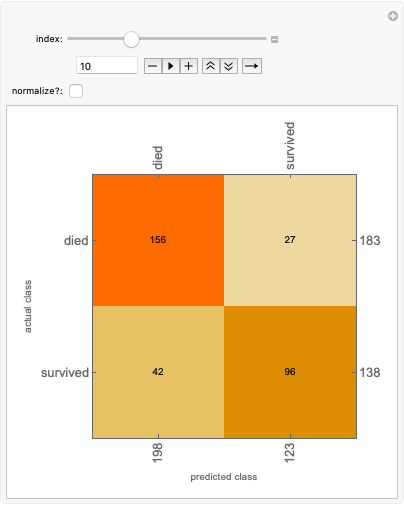

# Trie based classifiers evaluation

Anton Antonov   
[MathematicaForPrediction at GitHub](https://github.com/antononcube/MathematicaForPrediction)   
[MathematicaForPrediction at WordPress](https://mathematicaforprediction.wordpress.com)   
July, August 2022  

## Introduction

In this notebook we show how to evaluate Machine Learning (ML) classifiers based on Tries with frequencies, [AA1, AA2, AAp1], created over a well known ML dataset. The computations are done with packages and functions from the Wolfram Language (WL) ecosystem.

The classifiers based on Tries with frequencies can be seen as generalized [Naive Bayesian Classifiers (NBCs)](https://mathematicaforprediction.wordpress.com/2013/10/18/generation-of-naive-bayesian-classifiers/).

We use the workflow summarized in this flowchart:

```mathematica
Import["https://raw.githubusercontent.com/antononcube/MathematicaForPrediction/master/MarkdownDocuments/Diagrams/A-monad-for-classification-workflows/Classification-workflow-horizontal-layout.jpg"]
```



For more details on classification workflows see the article [“A monad for classification workflows”](https://mathematicaforprediction.wordpress.com/2018/05/15/a-monad-for-classification-workflows/), [AA3].

**Remark:** This notebook is the Mathematica counterpart of the Raku computable Markdown document with the same name [AA7, AA6]. 

**Remark:** Mathematica and WL are used as synonyms in this notebook.

------

## Data

In this section we obtain a dataset to make classification experiments with.

Through the Wolfram Function Repository (WFR) function [ExampleDataset](https://resources.wolframcloud.com/FunctionRepository/resources/ExampleDataset/) we can get data for [the Titanic ship wreck](https://en.wikipedia.org/wiki/Wreck_of_the_Titanic):

```mathematica
dsTitanic0 = ResourceFunction["ExampleDataset"][{"MachineLearning", "Titanic"}];
dsTitanic0[[1 ;; 4]]
```


**Remark:** ExampleDataset uses [ExampleData](https://reference.wolfram.com/language/ref/ExampleData.html). Datasets from the ExampleData's "MachineLearning" and "Statistics" collections are processed in order to obtain Dataset objects.

Instead of using the built-in Titanic data we use a version of it (which is used in [Mathematica-vs-R comparisons](https://github.com/antononcube/MathematicaVsR), [AAr1]):

```mathematica
dsTitanic[[1 ;; 4]]
```



Here is a summary of the data:

```mathematica
ResourceFunction["RecordsSummary"][dsTitanic]
```


------

## Make tries

In this section for demonstration purposes let us create a *shorter* trie and display it in tree form.

Here we drop the identifier column and take the record fields in a particular order, in which "passengerSurvival" is the last field:

```mathematica
lsRecords = Normal@dsTitanic[All, Prepend[KeyDrop[#, "id"], "passengerAge" -> ToString[#passengerAge]] &][All, {"passengerClass", "passengerSex", "passengerAge", "passengerSurvival"}][Values];
```

Here is a sample:

```mathematica
RandomSample[lsRecords, 3]

(*{{"3rd", "female", "-1", "died"}, {"1st", "female", "50", "survived"}, {"3rd", "male", "30", "died"}}*)
```

Here make a trie *without* the field "passengerAge":

```mathematica
trTitanic = TrieCreate[lsRecords[[All, {1, 2, 4}]]];
TrieForm[trTitanic, AspectRatio -> 1/4, ImageSize -> 900]
```


Here is a corresponding mosaic plot, [AA4, AAp3]:

```mathematica
MosaicPlot[lsRecords[[All, {1, 2, 4}]]]
```



**Remark:** The function MosaicPlot uses tries with frequencies in its implementation. Observing and reasoning with mosaic plots should make it clear that tries with frequencies are (some sort of) generalized Naive Bayesian classifiers.

------

## Trie classifier

In this section we create a Trie-based classifier.

In order to make certain reproducibility statements for the kind of experiments shown here, we use random seeding (with SeedRandom) before any computations that use pseudo-random numbers. Meaning, one would expect WL code that starts with a SeedRandom statement (e.g. SeedRandom[89]) to produce the same pseudo random numbers if it is executed multiple times (without changing it.)

```mathematica
SeedRandom[12];
```

Here we split the data into training and testing data in a stratified manner (a split for each label):

```mathematica
aSplit1 = GroupBy[lsRecords, #[[-1]] &, AssociationThread[{"training", "testing"}, TakeDrop[RandomSample[#], Round[0.75*Length[#]]]] &];
Map[Length, aSplit1, {2}]

(*<|"survived" -> <|"training" -> 375, "testing" -> 125|>, "died" -> <|"training" -> 607, "testing" -> 202|>|>*)
```

Here we aggregate training and testing data (and show the corresponding sizes):

```mathematica
aSplit2 = <|
    "training" -> Join @@ Map[#training &, aSplit1], 
    "testing" -> Join @@ Map[#testing &, aSplit1]|>;
Length /@ aSplit2

(*<|"training" -> 982, "testing" -> 327|>*)
```

Here we make a trie with the training data (and show the node counts):

```mathematica
trTitanic = TrieNodeProbabilities[TrieCreate[aSplit2["training"]]];
TrieNodeCounts[trTitanic]

(*<|"total" -> 142, "internal" -> 60, "leaves" -> 82|>*)
```

Here is an example *decision*-classification:

```mathematica
TrieClassify[trTitanic, {"1st", "female"}]

(*"survived"*)
```

Here is an example *probabilities*-classification:

```mathematica
TrieClassify[trTitanic, {"1st", "female"}, "Probabilities"]

(*<|"survived" -> 0.962264, "died" -> 0.0377358|>*)
```

We want to classify across all testing data, but not all testing data records might be present in the trie. Let us check that such testing records are few (or none):

```mathematica
Tally[Map[TrieKeyExistsQ[trTitanic, #] &, aSplit2["testing"]]]

(*{{True, 321}, {False, 6}}*)
```

Let us remove the records that cannot be classified:

```mathematica
lsTesting = Pick[aSplit2["testing"], Map[TrieKeyExistsQ[trTitanic, #] &, aSplit2["testing"]]];
Length[lsTesting]

(*321*)
```

Here we classify all testing records and show a sample of the obtained actual-predicted pairs:

```mathematica
lsClassRes = {Last[#], TrieClassify[trTitanic, Most[#]]} & /@ lsTesting;
RandomSample[lsClassRes, 6]

(*{{"survived", "survived"}, {"died", "survived"}, {"died", "died"}, {"survived", "survived"}, {"survived", "died"}, {"survived", "survived"}}*)
```

Here we cross tabulate the actual vs predicted labels using WFR's [CrossTabulate](https://resources.wolframcloud.com/FunctionRepository/resources/CrossTabulate):

```mathematica
ResourceFunction["CrossTabulate"][lsClassRes]
```



The cross-tabulation results look bad because the default decision threshold is used. We get better results by selecting a decision threshold via [Receiver Operating Characteristic (ROC)](https://en.wikipedia.org/wiki/Receiver_operating_characteristic) plots.

------

## Trie classification with ROC plots

In this section we systematically evaluate the Trie-based classifier using the  [Receiver Operating Characteristic (ROC) framework](https://en.wikipedia.org/wiki/Receiver_operating_characteristic).  

Here we classify all testing data records. For each record:

- Get probabilities association

- Add to that association the actual label

- Make sure the association has both survival labels

```mathematica
lsClassRes = Map[Join[<|"survived" -> 0, "died" -> 0, "actual" -> #[[-1]]|>, TrieClassify[trTitanic, #[[1 ;; -2]], "Probabilities"]] &, lsTesting];
```

Here we make a ROC record, [AA5, AAp4]:

```mathematica
ToROCAssociation[{"survived", "died"}, #actual & /@ lsClassRes, Map[If[#survived >= 0.5, "survived", "died"] &, lsClassRes]]

(*<|"TruePositive" -> 71, "FalsePositive" -> 14, "TrueNegative" -> 184, "FalseNegative" -> 52|>*)
```

Here we obtain the range of the label “survived”:

```mathematica
lsVals = Map[#survived &, lsClassRes];
MinMax[lsVals]

(*{0, 1.}*)
```

Here we make list of decision thresholds:


In the following code cell for each threshold:

- For each classification association decide on “survived” if the corresponding value is greater or equal to the threshold

- Make threshold’s ROC-association

```mathematica
lsROCs = Table[
    ToROCAssociation[{"survived", "died"}, #actual & /@ lsClassRes, Map[If[#survived >= th, "survived", "died"] &, lsClassRes]], 
    {th, lsThresholds}];
```

Here is the obtained ROCs dataset:

```mathematica
Dataset[MapThread[Prepend[#1, "Threshold" -> #2] &, {lsROCs, lsThresholds}]]
```


Here is the corresponding ROC plot:

```mathematica
ROCPlot["FPR", "TPR", lsThresholds, lsROCs, GridLines -> Automatic, ImageSize -> Large]
```



We can see the Trie-based classifier has reasonable prediction abilities -- we get ≈ 80% True Positive Rate (TPR) for a relatively small False Positive Rate (FPR), ≈ 20%.

-------

## Confusion matrices

Using ClassifierMeasurements we can produce the corresponding confusion matrix plots (using "made on the spot" [Manipulate](https://reference.wolfram.com/language/ref/Manipulate.html) interface):

```mathematica
DynamicModule[{lsThresholds = lsThresholds, lsClassRes = lsClassRes, lsClassRes2}, 
  Manipulate[
   lsClassRes2 = Map[{#actual, If[#survived >= lsThresholds[[i]], "survived", "died"]} &, lsClassRes]; 
   Append[DeleteCases[ClassifierMeasurements[lsClassRes2[[All, 1]], lsClassRes2[[All, 2]], "ConfusionMatrixPlot"], ImageSize -> _], ImageSize -> Medium], 
   {{i, Flatten[Position[lsThresholds, Nearest[lsThresholds, 0.3][[1]]]][[1]], "index:"}, 1, Length[lsThresholds], 1, Appearance -> "Open"}, 
   {{normalizeQ, False, "normalize?:"}, {False, True}} 
  ] 
 ]
```



------

## References

### Articles

[AA1] Anton Antonov, ["Tries with frequencies for data mining"](https://mathematicaforprediction.wordpress.com/2013/12/06/tries-with-frequencies-for-data-mining/), (2013), [MathematicaForPrediction at WordPress](https://mathematicaforprediction.wordpress.com).

[AA2] Anton Antonov, ["Tries with frequencies in Java"](https://mathematicaforprediction.wordpress.com/2017/01/31/tries-with-frequencies-in-java/), (2017), [MathematicaForPrediction at WordPress](https://mathematicaforprediction.wordpress.com).

[AA3] Anton Antonov, ["A monad for classification workflows"](https://mathematicaforprediction.wordpress.com/2018/05/15/a-monad-for-classification-workflows/), (2018), [MathematicaForPrediction at WordPress](https://mathematicaforprediction.wordpress.com).

[AA4] Anton Antonov, ["Mosaic plots for data visualization"](https://mathematicaforprediction.wordpress.com/2014/03/17/mosaic-plots-for-data-visualization/), (2014), [MathematicaForPrediction at WordPress](https://mathematicaforprediction.wordpress.com).

[AA5] Anton Antonov, ["Basic example of using ROC with Linear regression"](https://mathematicaforprediction.wordpress.com/2016/10/12/basic-example-of-using-roc-with-linear-regression/), (2016), [MathematicaForPrediction at WordPress](https://mathematicaforprediction.wordpress.com).

[AA6] Anton Antonov, ["Trie based classifiers evaluation"](https://github.com/antononcube/RakuForPrediction-book/blob/main/Articles/Trie-based-classifiers-evaluation.md), (2022), [RakuForPrediction-book at GitHub/antononcube](https://github.com/antononcube/RakuForPrediction-book).

[AA7] Anton Antonov, ["Trie based classifiers evaluation"](https://rakuforprediction.wordpress.com/2022/07/07/trie-based-classifiers-evaluation/), (2022), [RakuForPrediction at WordPress](https://rakuforprediction.wordpress.com).

### Packages

[AAp1] Anton Antonov, [TriesWithFrequencies Mathematica package](https://github.com/antononcube/MathematicaForPrediction/blob/master/TriesWithFrequencies.m), (2014-2022), [MathematicaForPrediction at GitHub/antononcube](https://github.com/antononcube/MathematicaForPrediction).

[AAp2] Anton Antonov, [ROCFunctions Mathematica package](https://github.com/antononcube/MathematicaForPrediction/blob/master/ROCFunctions.m), (2016), [MathematicaForPrediction at GitHub/antononcube](https://github.com/antononcube/MathematicaForPrediction).

[AAp3] Anton Antonov, [MosaicPlot Mathematica package](https://github.com/antononcube/MathematicaForPrediction/blob/master/MosaicPlot.m), (2014), [MathematicaForPrediction at GitHub/antononcube](https://github.com/antononcube/MathematicaForPrediction).

### Repositories

[AAr1] Anton Antonov, [Mathematica vs. R project](https://github.com/antononcube/MathematicaVsR), (2018-2022), [GitHub/antononcube](https://github.com/antononcube).

-------

## Setup

```mathematica
Import["https://raw.githubusercontent.com/antononcube/MathematicaForPrediction/master/TriesWithFrequencies.m"];
Import["https://raw.githubusercontent.com/antononcube/MathematicaForPrediction/master/ROCFunctions.m"];
Import["https://raw.githubusercontent.com/antononcube/MathematicaForPrediction/master/MosaicPlot.m"];
```

```mathematica
dsTitanic = Import["https://raw.githubusercontent.com/antononcube/MathematicaVsR/master/Data/MathematicaVsR-Data-Titanic.csv", "Dataset", HeaderLines -> 1];
```
